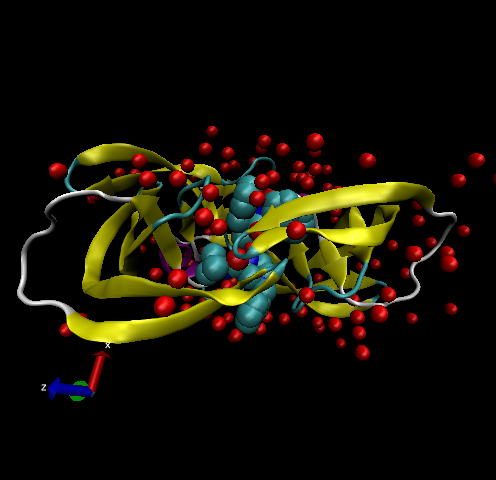

# Structural Bioinformatics (Part 1)

# 1. PDB Statistics

```{r}
db <- read.csv("Data Export Summary.csv", row.names=1)
head(db)
```


> **Q1**. What percentage of structures in the PDB are solved by X-Ray and Electron Microscopy?

```{r}
method.sums <- colSums(db)
round((method.sums/method.sums["Total"]*100), 2)
```

*Answer*: 87.55% of structures in PDB are solved by X-Ray, and 4.92% are solved by Electron Microscopy.


> **Q2**. What proportion of the structures in the PDB are protein?

```{r}
round((db$Total/method.sums["Total"]*100),2)
```

*Answer*: 87.36% of the structures in the PDB are protein.


> **Q3**. Type HIV in the PDB website search box on the home page and determine how many HIV-1 protease structures are in the current PDB.

*Answer*: There are 1,828 HIV-1 protease structures in the current PDB.


# 2. Visualizing the HIV-1 Protease Structure

> **Q4**. Water molecules normally have 3 atoms. Why do we see just one atom per water molecule in this structure?

*Answer*: The only atom visible in the water molecule is the oxygen atom. Hydrogen atoms are too small to visualize. Therefore, we can only see one atom per water molecule in this structure.


> **Q5**. There is a conserved water molecule in the binding site. Can you identify this water molecule? What residue number does this water molecule have (see note below)?

This water molecule is HOH308:O.

# VMD Visualization Image




> **Q6**. Optional Section
