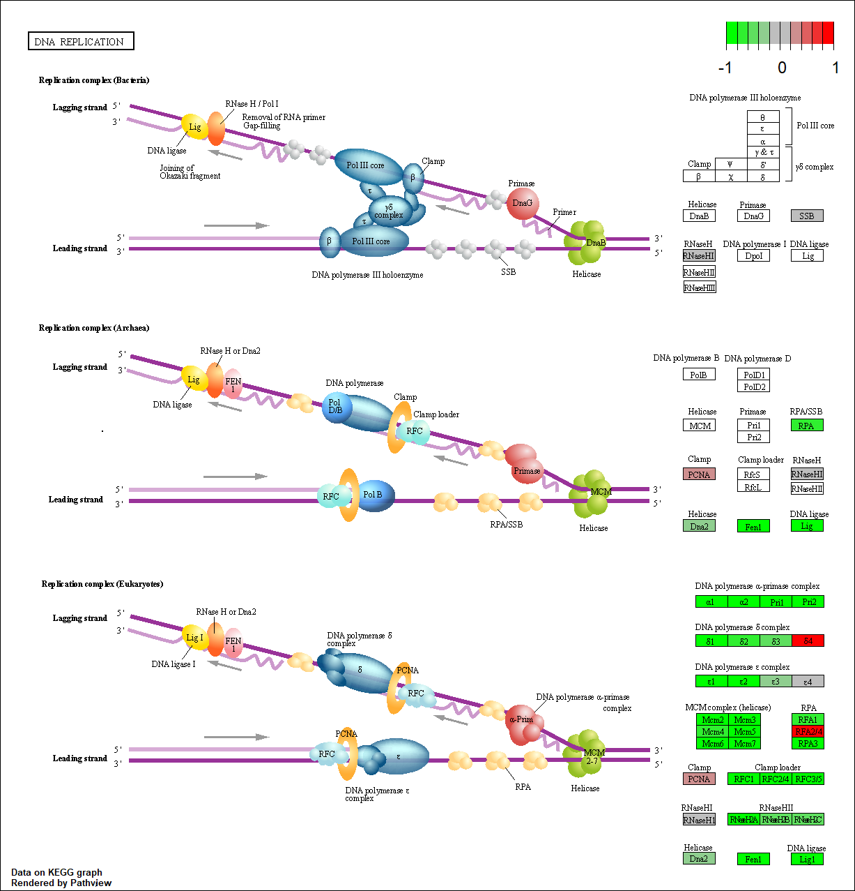

# Background

The data for for hands-on session comes from GEO entry: GSE37704, which is associated with the following publication:
> Trapnell C, Hendrickson DG, Sauvageau M, Goff L et al. "Differential analysis of gene regulation at transcript resolution with RNA-seq". Nat Biotechnol 2013 Jan;31(1):46-53. PMID: 23222703

The authors report on differential analysis of lung fibroblasts in response to loss of the developmental transcription factor HOXA1. Their results and others indicate that HOXA1 is required for lung fibroblast and HeLa cell cycle progression. In particular their analysis show that "loss of HOXA1 results in significant expression level changes in thousands of individual transcripts, along with isoform switching events in key regulators of the cell cycle". For our session we have used their Sailfish gene-level estimated counts and hence are restricted to protein-coding genes only.


# Data Import

```{r}
library(DESeq2)
```

Load our data files.

```{r}
metaFile <- "GSE37704_metadata.csv"
countFile <- "GSE37704_featurecounts.csv"

# Import metadata and take a peak
colData = read.csv(metaFile, row.names=1)
head(colData)

# Import countdata
countData = read.csv(countFile, row.names=1)
head(countData)
```


> **Q1**. Complete the code below to remove the troublesome first column from countData.

*Answer*:

```{r}
# Note we need to remove the odd first $length col
countData <- as.matrix(countData[,-1])
head(countData)
```


> **Q2**. Complete the code below to filter countData to exclude genes (i.e. rows) where we have 0 read count across all samples (i.e. columns). (Tip: What will **rowSums()** of countData return and how could you use it in this context?)

*Answer*: 

```{r}
# Filter count data where you have 0 read count across all samples.
countData = countData[rowSums(countData) > 0, ]
head(countData)
```


# Running DESeq2

```{r}
dds <- DESeqDataSetFromMatrix(countData=countData,
                             colData=colData,
                             design=~condition)
dds <- DESeq(dds)
```

```{r}
dds
```

Get results from HoxA1 knockdown vs. control siRNA.

```{r}
res <- results(dds, contrast=c("condition", "hoxa1_kd", "control_sirna"))
```


> **Q3**. Call the **summary()** function on your results to get a sense of how many genes are up or downregulated at the default 0.1 p-value cutoff.

*Answer*:

```{r}
summary(res)
```


# Volcano Plot

```{r}
plot(res$log2FoldChange, -log(res$padj))
```


> **Q4**. Improve this plot by completing the below code, which adds color and axis labels.

*Answer*:

```{r}
# Make a color vector for all genes
mycols <- rep("gray", nrow(res))

# Color red the genes with absolute fold change above 2
mycols[abs(res$log2FoldChange) > 2] <- "red"

# Color blue those with adjusted p-value less than 0.01
#  and absolute fold change more than 2
inds <- (res$padj < 0.01) & (abs(res$log2FoldChange) > 2)
mycols[inds] <- "blue"

plot(res$log2FoldChange, -log(res$padj), col=mycols, xlab="Log2(FoldChange)", ylab="-Log(P-value)" )
```


# Adding Gene Annotation

> **Q5**. Use the **mapIds()** function multiple times to add SYMBOL, ENTREZID and GENENAME annotation to our results by completing the code below.

*Answer*:

```{r}
library("AnnotationDbi")
library("org.Hs.eg.db")

columns(org.Hs.eg.db)

res$symbol = mapIds(org.Hs.eg.db,
                    keys=row.names(res), 
                    keytype="ENSEMBL",
                    column="SYMBOL",
                    multiVals="first")

res$entrez = mapIds(org.Hs.eg.db,
                    keys=row.names(res),
                    keytype="ENSEMBL",
                    column="ENTREZID",
                    multiVals="first")

res$name = mapIds(org.Hs.eg.db,
                    keys=row.names(res),
                    keytype="ENSEMBL",
                    column="GENENAME",
                    multiVals="first")

head(res, 10)
```


> **Q6**. Finally for this section let's reorder these results by adjusted p-value and save them to a CSV file in your current project directory.

```{r}
res <- res[order(res$pvalue), ]
write.csv(res, file="deseq_results.csv")
```


# Pathway Analysis

Now we can load the three packages and set up the KEGG datasets we need.

```{r}
library(pathview)
library(gage)
library(gageData)

data(kegg.sets.hs)
data(sigmet.idx.hs)

# Focus on signaling and metabolic pathways only
kegg.sets.hs = kegg.sets.hs[sigmet.idx.hs]

# Examine the first 3 pathways
head(kegg.sets.hs, 3)
```

```{r}
foldchanges <- res$log2FoldChange
names(foldchanges) <- res$entrez
head(foldchanges)
```

Now let's run the **gage** pathway analysis.

```{r}
# Get the results
keggres <- gage(foldchanges, gsets=kegg.sets.hs)
```

Let's look at the object returned from **gage()**.

```{r}
attributes(keggres)
```

Let's look at the first few downregulated (less) pathways.

```{r}
head(keggres$less)
```

Let's try out the 'pathview()' function from the **pathview** package to make a pathway plot with our RNA-Seq expression results shown in color.

```{r}
pathview(gene.data=foldchanges, pathway.id="hsa04110")
```


Now, let's process our results a bit more to automaticaly pull out the top 5 upregulated pathways, then further process that just to get the pathway IDs needed by the **pathview()** function.

```{r}
# Focus on top 5 upregulated pathways here for demo purposes only
keggrespathways <- rownames(keggres$greater)[1:5]

# Extract the 8 character long IDs part of each string
keggresids = substr(keggrespathways, start=1, stop=8)
keggresids
```

Now let's pass these IDs in keggresids to the **pathview()** function to draw plots for all the top 5 pathways.

```{r}
pathview(gene.data=foldchanges, pathway.id=keggresids, species="hsa")
```


 


> **Q7**. Can you do the same procedure as above to plot the pathview figures for the top 5 downregulated pathways?

*Answer*: 

```{r}
# Focus on top 5 upregulated pathways here for demo purposes only
keggrespathways2 <- rownames(keggres$less)[1:5]

# Extract the 8 character long IDs part of each string
keggresidsless = substr(keggrespathways2, start=1, stop=8)
keggresidsless
```

```{r}
pathview(gene.data=foldchanges, pathway.id=keggresidsless, species="hsa")
```





# Gene Ontology (GO)

We can also do a similar procedure with gene ontology. Similar to above, **go.sets.hs** has all GO terms. **go.subs.hs** is a named list containing indexes for the BP, CC, and MF ontologies. Let’s focus on BP (a.k.a Biological Process) here.

```{r}
data(go.sets.hs)
data(go.subs.hs)

# Focus on Biological Process subset of GO
gobpsets = go.sets.hs[go.subs.hs$BP]

gobpres = gage(foldchanges, gsets=gobpsets, same.dir=TRUE)

lapply(gobpres, head)
```


# Reactome Analysis

Using R, output the list of significant genes at the 0.05 level as a plain text file.

```{r}
sig_genes <- res[res$padj <= 0.05 & !is.na(res$padj), "symbol"]
print(paste("Total number of significant genes:", length(sig_genes)))
```

```{r}
write.table(sig_genes, file="significant_genes.txt", row.names=FALSE, col.names=FALSE, quote=FALSE)
```


> **Q8**. What pathway has the most significant "Entities p-value"? Do the most significant pathways listed match your previous KEGG results? What factors could cause differences between the two methods?

*Answer*: The endosomal/vacuolar pathway has the most significant "Entities p-value" of 8.59E-4. The most significant pathways slightly differ from my previous KEGG results. The different extent of pathways documented in KEGG and Reactome could cause differences between the two methods. Moreover, the varying screening parameters of the two methods may contribute to differences.


# GO Online (Optional)

> **Q9**. What pathway has the most significant "Entities p-value"? Do the most significant pathways listed match your previous KEGG results? What factors could cause differences between the two methods?

*Answer*: The biological process pathway has the most significant "Entities p-value" of 5.05E-64. The most significant pathways listed do not match my previous KEGG results. One factor contributing to these differences may be that our analysis using KEGG focused only on signaling and metabolic pathways. Furthermore, GO Online searches for both the overrepresented and underrepresented ontologies. 