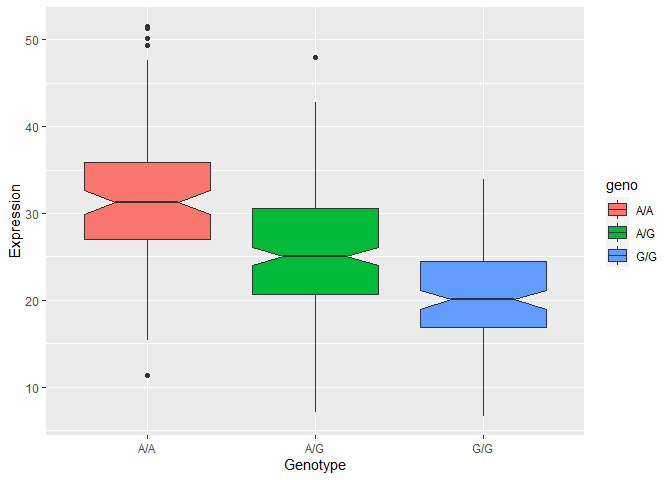

Class 19: Genome Informatics
================
Jasmine Lee (PID: A15583527)
11/30/2021

# Section 1. Proportion of G/G in a Population

Downloaded a CSV file from Ensemble
<https://uswest.ensembl.org/Homo_sapiens/Variation/Sample?db=core;r=17:39894595-39895595;v=rs8067378;vdb=variation;vf=105535077#373531_tablePanel>.

Here we read this CSV file.

``` r
mxl <- read.csv("373531-SampleGenotypes-Homo_sapiens_Variation_Sample_rs8067378.csv")
head(mxl)
```

    ##   Sample..Male.Female.Unknown. Genotype..forward.strand. Population.s. Father
    ## 1                  NA19648 (F)                       A|A ALL, AMR, MXL      -
    ## 2                  NA19649 (M)                       G|G ALL, AMR, MXL      -
    ## 3                  NA19651 (F)                       A|A ALL, AMR, MXL      -
    ## 4                  NA19652 (M)                       G|G ALL, AMR, MXL      -
    ## 5                  NA19654 (F)                       G|G ALL, AMR, MXL      -
    ## 6                  NA19655 (M)                       A|G ALL, AMR, MXL      -
    ##   Mother
    ## 1      -
    ## 2      -
    ## 3      -
    ## 4      -
    ## 5      -
    ## 6      -

``` r
table(mxl$Genotype..forward.strand.)
```

    ## 
    ## A|A A|G G|A G|G 
    ##  22  21  12   9

``` r
table(mxl$Genotype..forward.strand.) / nrow(mxl) * 100
```

    ## 
    ##     A|A     A|G     G|A     G|G 
    ## 34.3750 32.8125 18.7500 14.0625

Now let’s look at a different population. I picked the GBR.

``` r
gbr <- read.csv("373522-SampleGenotypes-Homo_sapiens_Variation_Sample_rs8067378.csv")
head(gbr)
```

    ##   Sample..Male.Female.Unknown. Genotype..forward.strand. Population.s. Father
    ## 1                  HG00096 (M)                       A|A ALL, EUR, GBR      -
    ## 2                  HG00097 (F)                       G|A ALL, EUR, GBR      -
    ## 3                  HG00099 (F)                       G|G ALL, EUR, GBR      -
    ## 4                  HG00100 (F)                       A|A ALL, EUR, GBR      -
    ## 5                  HG00101 (M)                       A|A ALL, EUR, GBR      -
    ## 6                  HG00102 (F)                       A|A ALL, EUR, GBR      -
    ##   Mother
    ## 1      -
    ## 2      -
    ## 3      -
    ## 4      -
    ## 5      -
    ## 6      -

Find proportion of G\|G.

``` r
table(gbr$Genotype..forward.strand.) / nrow(gbr) * 100
```

    ## 
    ##      A|A      A|G      G|A      G|G 
    ## 25.27473 18.68132 26.37363 29.67033

This variant that is associated with childhood asthma is more frequent
in the GBR population than the MKL population.

Let’s now dig into this further.

# Section 4. Population Scale Analysis

Downloaded a TXT file with the normalization of 230 samples on a genome
level &lt;<https://bioboot.github.io/bggn213_W19/classmaterial/>
rs8067378\_ENSG00000172057.6.txt&gt;. We want to determine whether there
is any association of the 4 asthma-associated SNPs on ORMDL3 expression.

> **Q13**. Read this file into R and determine the sample size for each
> genotype and their corresponding median expression levels for each of
> these genotypes. **Hint**: The **read.table()**, **summary()** and
> **boxplot()** functions will likely be useful here. There is an
> example R script online to be used ONLY if you are struggling in vein.
> Note that you can find the median value from saving the output of the
> **boxplot()** function to an R object and examining this object. There
> is also the **median()** and **summary()** function that you can use
> to check your understanding.

``` r
# Read TXT file in to R and store as expr
expr <- read.table("rs8067378_ENSG00000172057.6.txt")
head(expr)
```

    ##    sample geno      exp
    ## 1 HG00367  A/G 28.96038
    ## 2 NA20768  A/G 20.24449
    ## 3 HG00361  A/A 31.32628
    ## 4 HG00135  A/A 34.11169
    ## 5 NA18870  G/G 18.25141
    ## 6 NA11993  A/A 32.89721

``` r
# Determine total number of samples
nrow(expr)
```

    ## [1] 462

``` r
# Determine the sample size for each genotype
table(expr$geno)
```

    ## 
    ## A/A A/G G/G 
    ## 108 233 121

``` r
# Create a boxplot of expression vs. genotype and store as pop
pop <- boxplot(exp~geno, data=expr)
```

<!-- -->

``` r
# Determine the median expression levels for each genotype
# The third row displays the median values for each genotype
round(pop$stats, 2)
```

    ##       [,1]  [,2]  [,3]
    ## [1,] 15.43  7.08  6.67
    ## [2,] 26.95 20.63 16.90
    ## [3,] 31.25 25.06 20.07
    ## [4,] 35.96 30.55 24.46
    ## [5,] 49.40 42.76 33.96

*Answer*: The sample size is 108 for genotype A\|A, 233 for genotype
A\|G, and 121 for genotype G\|G. The median expression level is 31.25
for genotype A\|A, 25.06 for genotype A\|G, and 20.07 for genotype G\|G.

> **Q14**. Generate a boxplot with a box per genotype. What could you
> infer from the relative expression value between A\|A and G\|G
> displayed in this plot? Does the SNP affect the expression of ORMDL3?
> **Hint**: An example boxplot is provided overleaf - yours does not
> need to be as polished as this one.

``` r
library(ggplot2)
```

Let’s make a boxplot.

``` r
ggplot(expr) + aes(x=geno, y=exp, fill=geno) +
  geom_boxplot(notch=TRUE) +
  xlab("Genotype") +
  ylab("Expression")
```

<!-- -->

*Answer*: There appears to be a statistically significant difference in
expression between the genotypes A\|A and G\|G. Thus, I infer that there
is an association between the genotype of G\|G at this location and
reduced expression of ORMDL3. The SNP affects the expression of ORMDL3.
